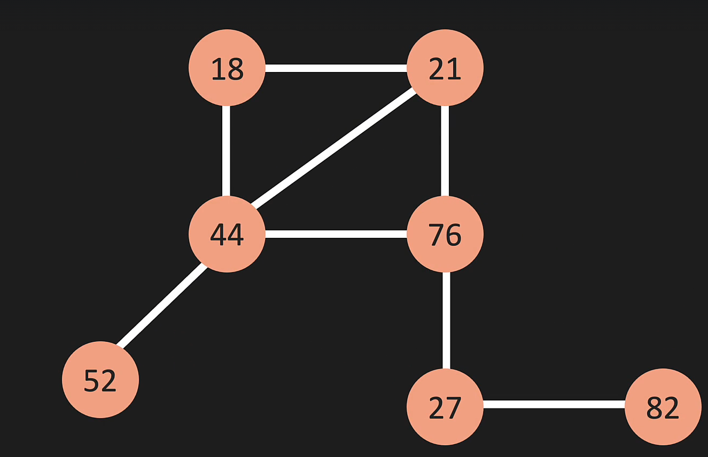
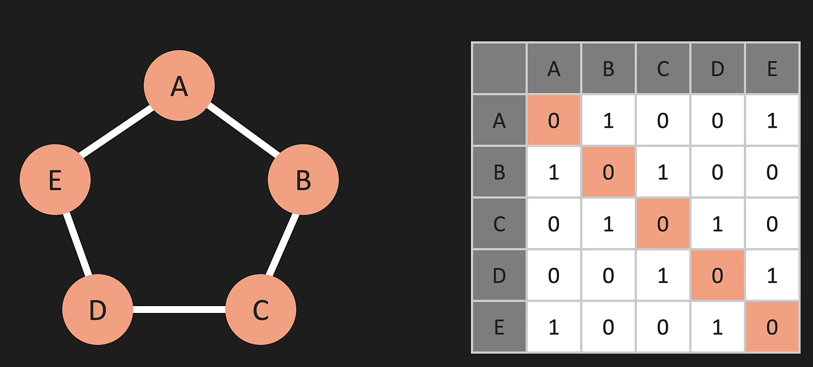
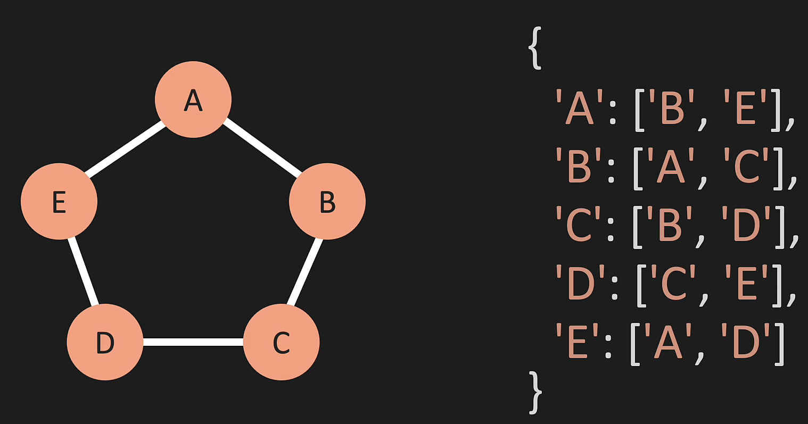

## Vertex, and Edge (can be weighted or not)
- Graphs without arrows are assumed to be bidirectional

## Adjacensy Matrix:
- Will always have a 45º line with 0s
- If it is bidirectional, it is also gonna be mirrored

## Adjacensy List:
- Dictionary, each KEY is the VERTEX, and the value is a list of VERTICES it has a connection with

## BIG O
### Representation:
- Space Complexity of Matrix: O( |V|² ) ----> Has to store all Vertices even if they aren't connected
- Space Complexity of List: O( |V| + |E| ) ---> Only stores Vertices + connected Edges

### Adding JUST the Vertex:
- Matrix: O( |V| ²)
- List: O(1)

### Adding an EDGE:
- Both are O(n)

### Removing EDGE:
- Matrix: O(1)
- List: O(|E|)

### Remove VERTEX:
- Matrix: O(|V|²)
- List: O(|V| + |E|)

### Removing
