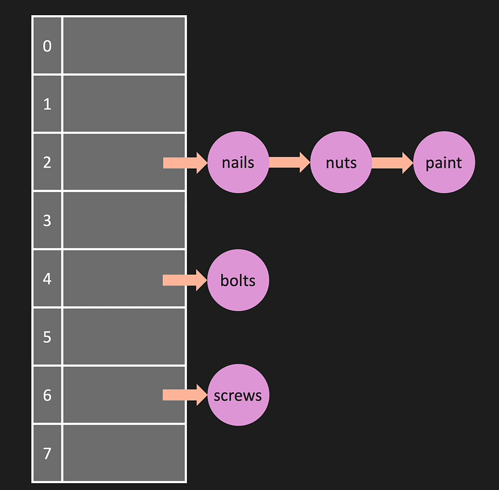

### One-way:
- Can produce a value, but can't produce a key while going through the hash

### Deterministic:
- Every time we give a key, we expect a determined value

## How it works:
- We create our own address space ( list )
- create method to set key-value pairs 'set_item('nails, 1000)'
- create our own hash to hash the key
- the key-value pair is going to be a list ['nails', 1000] and the hash is going to produce an address in our list

## Collisions:
### Separate Chaining: 
- If we have more than one key-value pairs going into the same address, we put then into a list
- So it's a list (key-value) inside a list (collection of key-values in X address) inside a list (Address)

### Linear Probing (open addressing):
- Instead of storing multiple key-values into one address, we search for the next empty address

### LinkedLists:

## BIG O:
- hash: O(1)
- set/append: O(1)
- get_key: O(1) -> we treat collisions as being VERY RARE in has maps
- lookup_value: O(n)

